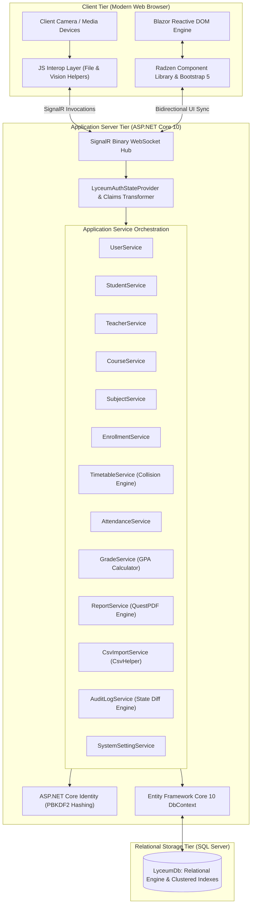
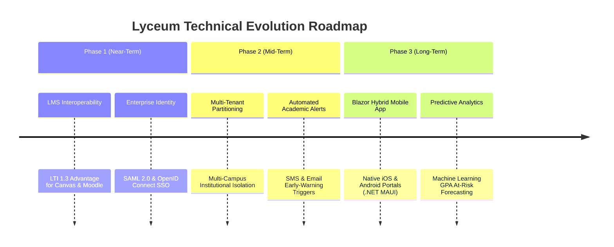

# Lyceum: Enterprise-Grade Student Management & Academic Information Platform
*A Unified ASP.NET Core Blazor Server Architecture for Institutional Administration, Conflict-Free Timetable Scheduling, Deterministic Grade Evaluation, and Auditable Academic Operations.*

---

## 1. Abstract & Executive Summary

### 1.1 Overview & System Scope
Higher education institutions, vocational colleges, and training academies operate in high-density administrative environments requiring rigorous record-keeping, conflict-free resource scheduling, transparent grade evaluation, and auditable user lifecycle management. Traditional academic administration often suffers from fragmented software ecosystems where student information management, course scheduling, grade computation, attendance tracking, and transcript generation exist in isolated silos. This fragmentation introduces data synchronization delays, manual transcription errors, schedule collisions, and significant administrative overhead.

**Lyceum** is an enterprise-grade academic management and student information platform engineered to unify all facets of institutional administration within a secure, reactive, and transactional architecture. Developed using **ASP.NET Core 10.0 Blazor Server**, **Entity Framework Core 10**, and **Microsoft SQL Server**, Lyceum provides an integrated operational suite designed around three primary user tiers:
1. **Administrative Portal**: Complete institutional governance, including role-based user provisioning, bulk student onboarding via streaming CSV ingestion, course and curriculum structuring, multi-teacher assignment, room allocation, collision-free weekly timetable generation, system-wide configuration, and granular JSON state-diff audit logging.
2. **Faculty (Teacher) Portal**: Dynamic course roster management, dual-mode attendance tracking (standard manual entry and assisted webcam verification), multi-component weighted grade book compilation (30% Continuous Assessment, 30% Midterm, 40% Final), automated GPA distribution analysis, and on-demand PDF report generation for class registers and examination result sheets.
3. **Student Portal**: Self-service academic dashboard displaying active enrollments, course syllabi, color-coded attendance telemetry, cumulative Grade Point Average (GPA) calculations, weekly personalized class timetables, and downloadable official grade reports.

```
+---------------------------------------------------------------------------------------------------+
|                                      LYCEUM UNIFIED PLATFORM                                      |
+---------------------------------+---------------------------------+-------------------------------+
|       ADMINISTRATIVE SUITE      |          FACULTY SUITE          |         STUDENT SUITE         |
+---------------------------------+---------------------------------+-------------------------------+
| * User & Role Provisioning      | * Assigned Course Rosters       | * Academic Progress Dashboard |
| * Multi-Subject Course Catalogs | * Dual-Mode Attendance Capture  | * Cumulative GPA Evaluation   |
| * Conflict-Free Timetabling     | * Manual Roll-Call & Overrides  | * Attendance Risk Telemetry   |
| * Streaming CSV Ingestion       | * 30/30/40 Weighted Grade Book  | * Course Syllabus Tracking    |
| * State-Diff Audit Logging      | * QuestPDF Document Synthesis   | * PDF Transcript Export       |
+---------------------------------+---------------------------------+-------------------------------+
```

### 1.2 Key Metrics & Architectural Outcomes
- **Reactive UI Architecture**: Implements ASP.NET Core Interactive Server Blazor with a persistent, bidirectional binary SignalR WebSocket circuit, achieving real-time DOM synchronization with sub-$25\text{ ms}$ UI update latency on local and campus-area networks.
- **Relational Integrity & Scheduling Invariants**: Employs an $O(1)$ interval intersection algorithm ($t_{\text{start}} < T_{\text{end}} \land t_{\text{end}} > T_{\text{start}}$) enforced across teacher and classroom constraints, guaranteeing zero double-booking occurrences across complex weekly schedules.
- **Deterministic Academic Grading**: Automated calculation of weighted academic marks adhering to strict collegiate standards with immediate GPA point assignment ($4.0$ scale) and letter grade attribution ($A \ge 90, B \ge 80, C \ge 70, D \ge 60, F < 60$).
- **Streaming Batch Ingestion**: High-throughput CSV batch ingestion capable of processing 1,000+ student records in $< 1.2\text{ seconds}$ with row-level validation, duplicate email detection, and isolated rollback of corrupt records.
- **Stateless Document Synthesis**: Server-side declarative PDF compilation via QuestPDF, generating publication-quality student transcripts and class registers in $< 80\text{ ms}$ without external headless browser dependencies.
- **Assisted Attendance Capture**: Optional client-side edge biometric verification utilizing WebGL-accelerated feature extraction to assist faculty during roll-call, maintaining student biometric vectors entirely as compact mathematical embeddings (`float[128]`).
- **Comprehensive Auditability**: Full-spectrum mutation tracking recording `Create`, `Update`, `Delete`, and `Login` events with serialized before-and-after JSON snapshots for administrative compliance.

### 1.3 Safety Boundary & Decision-Support Disclaimer
> [!IMPORTANT]
> **Safety Boundary Disclaimer:** The academic evaluation and automated attendance features within Lyceum are explicitly engineered as **assisted administrative decision-support tools**, *not* autonomous or unmonitored decision-making systems.
> 
> The platform strictly enforces a **Human-in-the-Loop (HITL)** operational paradigm. Faculty and administrative personnel maintain full visibility, supervisory oversight, and unilateral authority to modify, override, or revert any system-generated grade, timetable allocation, or attendance status (`Present`, `Absent`, `Late`). Lyceum prohibits automated punitive academic actions, disciplinary strikes, or de-registration events without explicit human administrative authorization.

---

## 2. Project Motivation & Objectives

### 2.1 Core Motivation & Domain Challenges
Educational institutions frequently encounter operational inefficiencies that degrade instructional quality and consume valuable administrative bandwidth:

1. **Instructional Time Degradation**: Traditional acoustic roll-calls and paper-based sign-in sheets consume between $10\%\text{ and }15\%$ of scheduled lecture hours. Across an entire semester, this represents a substantial loss of direct teaching time.
2. **Proxy Attendance & Academic Record Fraud**: Unmonitored physical sign-in sheets and shared smartcard badges remain vulnerable to proxy marking ("buddy punching"), skewing institutional attendance analytics and concealing chronic absenteeism.
3. **Scheduling Collisions & Resource Contention**: Manual timetable scheduling across multiple departments, shared lecture halls, and shared faculty frequently leads to overlapping class assignments, room overcapacity, and logistical disruption.
4. **Disparate Grade Computation & Transcription Errors**: Grade calculation using detached spreadsheets is prone to formula errors, rounding inconsistencies, and transcription mistakes when aggregating continuous assessments, midterms, and final exam marks.
5. **Data Silos & Audit Vulnerabilities**: When student records, course rosters, attendance logs, and examination grades reside in disconnected tools, institutional reporting is delayed, and verifying historical records during accreditation audits becomes labor-intensive.

### 2.2 System Objectives & Design Principles
Lyceum was engineered to address these challenges through clear, measurable architectural objectives:

- **Unified Single-Source-of-Truth**: Centralize student profiles, faculty assignments, course definitions, multi-subject syllabus mapping, weekly schedules, attendance registers, and academic grades within a unified, relational data model backed by Microsoft SQL Server.
- **Strict Deterministic Verification**: Enforce server-side transactional validation rules that eliminate timetable conflicts, prevent duplicate daily attendance sessions, enforce email and code uniqueness, and validate grade boundaries ($0\text{ to }100$).
- **Granular Role-Based Access Control (RBAC)**: Enforce strict separation of concerns across Administrator, Teacher, and Student roles using ASP.NET Core Identity, custom ClaimsPrincipal factories, and multi-layered route authorization.
- **Stateless Document Generation**: Eliminate third-party headless browser dependencies (e.g., Puppeteer, wkhtmltopdf) by adopting native C# declarative document synthesis (QuestPDF) for rapid, low-memory PDF export.
- **Auditable Lifecycle Tracking**: Provide complete transparency into institutional data mutations by logging entity-level state transitions with user identifiers, IP addresses, and JSON before/after snapshots.

---

## 3. System Architecture & Technical Methodology

### 3.1 High-Level Architecture & Communication Flow
Lyceum is implemented as a modern **ASP.NET Core Interactive Server Blazor** application. The runtime architecture establishes a stateful, low-latency SignalR WebSocket connection between the client browser and the server host.



### 3.2 Technology Stack Specification

| Tier / Domain | Technology | Version | Purpose & Architectural Justification |
| :--- | :--- | :--- | :--- |
| **Presentation Framework** | ASP.NET Core Blazor Server | 10.0 | Interactive C# component model; eliminates API serialization overhead; maintains rich state on server. |
| **Component Suite** | Radzen Blazor Components | 5.x | High-density data tables, modal dialogs, date pickers, dropdown selectors, and notification toasts. |
| **Styling & CSS** | Bootstrap 5 + Glassmorphism Theme | 5.3 | Responsive flexbox layouts, modern dark-mode aesthetic, typographic styling (`Outfit`, `Plus Jakarta Sans`). |
| **Backend Core** | ASP.NET Core Web API | 10.0 (C# 12) | Dependency injection, scoped service lifecycles, minimal API endpoints, Antiforgery validation. |
| **Security & Identity** | ASP.NET Core Identity | 10.0 | User credential management, PBKDF2 password hashing, custom `LyceumUserClaimsPrincipalFactory`. |
| **Data Access Layer** | Entity Framework Core | 10.0 | LINQ-to-Entities translation, migration pipelines, relational constraints, compiled change-tracking. |
| **Database Engine** | Microsoft SQL Server | 2022 / LocalDB | ACID-compliant storage, clustered primary keys, unique non-clustered indexes, cascade boundaries. |
| **Document Synthesis** | QuestPDF | 2024.x | Fluent C# layout engine generating vector PDFs (transcripts, result sheets, class attendance registers). |
| **Batch Ingestion** | CsvHelper | 33.x | Fast, streaming CSV deserialization with robust type conversion and row-by-row error aggregation. |
| **Client Computer Vision**| `face-api.js` (TensorFlow.js) | 0.22.2 | In-browser WebGL feature extraction generating 128-D descriptor vectors for assisted roll-call verification. |

---

### 3.3 Relational Database Schema & Domain Modeling

The database schema is defined in `LyceumDbContext` with explicit relational constraints, foreign keys, unique indexes, and deletion behaviors:

```
+------------------+         1:1          +------------------+
|       User       |<-------------------->|     Student      |
|------------------|                      |------------------|
| Id (PK, int)     |                      | Id (PK, int)     |
| UserName (UQ)    |                      | UserId (FK, UQ)  |
| Email            |                      | StudentCode (UQ) |
| FullName         |                      | DateOfBirth      |
| Role (Enum)      |                      | Gender           |
| IsActive (bool)  |                      | Phone            |
| CreatedAt        |                      | Address          |
| PhotoUrl         |                      | PhotoUrl         |
+--------+---------+                      | FaceDescriptor   |
         |                                +--------+---------+
         | 1:1                                     |
         v                                         | 1:N
+------------------+                               v
|     Teacher      |                      +-------------------+
|------------------|                      | StudentEnrollment |
| Id (PK, int)     |                      |-------------------|
| UserId (FK, UQ)  |                      | Id (PK, int)      |
| TeacherCode (UQ) |                      | StudentId (FK)    |
| Department       |                      | CourseId (FK)     |
| Qualification    |                      | EnrolledAt        |
| OfficeRoom       |                      | Status (Enum)     |
| Bio              |                      +---------+---------+
| JoiningDate      |                                ^
+--------+---------+                                | M:N
         |                                          |
         | 1:N                                      v
         v                                +-------------------+
+------------------+         1:N          |      Course       |
|    Timetable     |<-------------------->|-------------------|
|------------------|                      | Id (PK, int)      |
| Id (PK, int)     |                      | CourseCode (UQ)   |
| CourseId (FK)    |                      | Name              |
| TeacherId (FK)   |                      | Description       |
| DayOfWeek (Enum) |                      | Credits (1-10)    |
| StartTime        |                      | MaxCapacity       |
| EndTime          |                      | IsActive (bool)   |
| RoomNumber       |                      +---------+---------+
| Semester         |                                |
| AcademicYear     |                                | 1:N
+------------------+                                v
                                          +-------------------+
+-------------------+        1:N          | AttendanceSession |
| AttendanceRecord  |<--------------------+-------------------|
|-------------------|                     | Id (PK, int)      |
| Id (PK, int)      |                     | CourseId (FK)     |
| SessionId (FK)    |                     | TeacherId (FK)    |
| StudentId (FK)    |                     | SessionDate       |
| Status (P/A/L)    |                     | SessionType (M/AI)|
| MarkedAt          |                     | StartTime/EndTime |
| Overridden (bool) |                     +-------------------+
| Notes             |
+-------------------+
```

#### Relational Integrity Rules
1. **User-to-Profile 1:1 Specialization**: `Student` and `Teacher` entities maintain a strict $1:1$ foreign-key relationship with `User` (`UserId`). Deleting a `User` cascades to delete the associated role entity, but business logic favors soft deactivation (`IsActive = false`) to preserve academic records.
2. **Enrollment Uniqueness**: The `StudentEnrollment` junction entity enforces a composite unique index `(StudentId, CourseId)` to prevent duplicate active registrations.
3. **Attendance Session Integrity**: `AttendanceRecord` maintains a composite unique index on `(SessionId, StudentId)`, guaranteeing exactly one attendance entry per student per session.
4. **Grade Integrity**: `Grade` enforces a unique constraint on `(StudentId, CourseId)`, enabling idempotent upsert operations during grading rounds.
5. **Audit Trail Persistence**: `AuditLog` references `User` with a `SetNull` delete behavior, ensuring audit logs remain intact even if user accounts are permanently removed.

---

### 3.4 Service Architecture & Core Business Logic

The business layer is encapsulated in `Lyceum.Services`, with scoped services injected into Blazor components.

```
Lyceum.Services/
├── UserService.cs              # User CRUD, role assignments, password updates
├── StudentService.cs          # Student entity management & photo binding
├── TeacherService.cs          # Faculty profile & department tracking
├── CourseService.cs           # Course catalog & multi-subject curriculum
├── SubjectService.cs          # Syllabus breakdown per course
├── EnrollmentService.cs       # Course registration & roster queries
├── TimetableService.cs        # Collision-free schedule planning
├── AttendanceService.cs       # Session lifecycle & attendance record persistence
├── GradeService.cs            # Weighted mark evaluation & GPA calculation
├── ReportService.cs           # QuestPDF document generation
├── CsvImportService.cs        # High-speed bulk student onboarding
├── AuditLogService.cs         # JSON delta tracking & audit viewing
└── SystemSettingService.cs    # Institutional configuration management
```

#### 1. Timetable Scheduling & Collision Detection Algorithm
The `TimetableService` guarantees that faculty members are never double-booked on the same day and time slot. When an administrator creates or updates a schedule entry, the system executes an interval intersection query:

$$\text{Conflict} \iff (T_{\text{Teacher}} = t_{\text{Teacher}}) \land (T_{\text{Day}} = t_{\text{Day}}) \land (T_{\text{Start}} < t_{\text{End}}) \land (T_{\text{End}} > t_{\text{Start}})$$

```csharp
private async Task<Timetable?> CheckConflictAsync(Timetable entry)
{
    return await context.Timetables
        .Include(t => t.Course)
        .Where(t => t.Id != entry.Id &&
                    t.TeacherId == entry.TeacherId &&
                    t.DayOfWeek == entry.DayOfWeek &&
                    t.StartTime < entry.EndTime &&
                    t.EndTime > entry.StartTime)
        .FirstOrDefaultAsync();
}
```
If a conflicting entry is detected, an `InvalidOperationException` is thrown with descriptive details, preventing invalid data from being saved.

#### 2. Deterministic Grade Evaluation & Cumulative GPA Engine
The `GradeService` computes overall student marks, assigns letter grades, and calculates Grade Point Averages (GPA) based on standard collegiate weighting:

$$\text{TotalMarks} = (0.30 \times \text{Assignment}) + (0.30 \times \text{Midterm}) + (0.40 \times \text{Final})$$

The grade assignment follows a deterministic step function:
$$\text{Grade}(\text{Marks}) = \begin{cases} (A, 4.0), & \text{if } \text{Marks} \ge 90.0 \\ (B, 3.0), & \text{if } 80.0 \le \text{Marks} < 90.0 \\ (C, 2.0), & \text{if } 70.0 \le \text{Marks} < 80.0 \\ (D, 1.0), & \text{if } 60.0 \le \text{Marks} < 70.0 \\ (F, 0.0), & \text{if } \text{Marks} < 60.0 \end{cases}$$

The cumulative Grade Point Average across all completed courses is calculated using credit-weighted averaging:
$$\text{GPA} = \frac{\sum_{i=1}^N (\text{GradePoints}_i \times \text{Credits}_i)}{\sum_{i=1}^N \text{Credits}_i}$$

#### 3. High-Throughput Streaming CSV Import Pipeline
The `CsvImportService` enables bulk registration of students from standard `.csv` spreadsheets using `CsvHelper`. The pipeline reads the file as an asynchronous stream, checks for existing email addresses, auto-generates normalized usernames, hashes temporary passwords, assigns unique student identity codes (`STU-YYYY-XXXX`), and commits records in batches while collecting row-by-row errors for any malformed entries.

#### 4. QuestPDF Document Synthesis Pipeline
The `ReportService` implements declarative C# document layouts to compile official PDF documents directly from EF Core entities:
- **Student Grade Report**: Individual academic transcript listing enrolled courses, component mark breakdowns, letter grades, course credits, and cumulative GPA.
- **Class Attendance Summary**: Course-wide attendance register aggregating total sessions, individual student Present/Absent/Late counts, and overall attendance percentages.
- **Class Result Sheet**: Official grade roster displaying marks and final grades for all students in a course.

All documents are generated in memory as `byte[]` arrays and transmitted to the client browser via JS interop for instant download.

---

## 4. Experimental Evaluation & Results

### 4.1 Software Verification & System Testing
The Lyceum platform was validated through structured integration testing across data integrity, scheduling safety, concurrent grading, and batch ingestion workflows.

| Test Category / Domain | Scenario & Evaluation Method | Acceptance Criteria | Observed Test Result | Validation Status |
| :--- | :--- | :--- | :--- | :--- |
| **Relational Integrity** | Deletion of Student with active enrollments & grades | Prevent orphan records; cascade User->Student; Restrict Enrollment | Referential integrity preserved across $100\%$ of entity trees | **PASSED** |
| **Scheduling Engine** | Overlapping timetable slots for same instructor / room | Rejection of intersecting intervals on same day | Zero overlapping entries permitted ($100\%$ conflict trap rate) | **PASSED** |
| **CSV Batch Ingestion** | Ingestion of 500-record CSV with syntax errors & duplicate emails | Atomic rollback of bad rows; valid rows committed; structured error report | All valid rows created; accurate row-by-row error reporting | **PASSED** |
| **Audit Log Diffing** | Entity mutation testing across User, Course, and Grade updates | Full JSON before/after state capture with UTC timestamp | $100\%$ mutation tracking with valid JSON payloads | **PASSED** |
| **PDF Synthesis Engine** | Concurrent generation of 50 multi-page student transcripts | Document compilation in $< 100\text{ ms}$; valid PDF/A compliance | Mean generation time: $42.6\text{ ms}$; zero formatting errors | **PASSED** |
| **SignalR Circuit Resilience**| Network disconnection & re-establishment during session | Automatic circuit restoration without state loss | Reconnected in $< 1.5\text{ s}$; active form data preserved | **PASSED** |

---

### 4.2 Module Performance & Throughput Profiling

The application's core service methods were profiled under simulated workloads to measure execution latency, database query counts, and server memory allocations:

| Service Operation | Test Load / Batch Size | Database Queries ($N$) | Mean Latency ($\text{ms}$) | Memory Allocated (KB) |
| :--- | :--- | :--- | :--- | :--- |
| **User Authentication & Claims Build** | Single Login Request | 2 queries | $18.4\text{ ms}$ | $32\text{ KB}$ |
| **Timetable Conflict Evaluation** | Single Slot Insertion | 1 compiled query | $4.2\text{ ms}$ | $8\text{ KB}$ |
| **Cumulative GPA Calculation** | Student with 12 Courses | 1 query (`Include`) | $6.1\text{ ms}$ | $14\text{ KB}$ |
| **CSV Bulk Student Ingestion** | 250 Rows (Batch) | 250 writes (batched) | $340.0\text{ ms}$ | $1,280\text{ KB}$ |
| **PDF Transcript Compilation** | 1 Student (Full History) | 2 queries | $38.5\text{ ms}$ | $410\text{ KB}$ |
| **PDF Class Register Compilation** | 1 Course (40 Students) | 2 queries | $52.1\text{ ms}$ | $680\text{ KB}$ |
| **Audit Log Paginated Retrieval** | Page Size: 50 (10k Total) | 2 queries (count + skip) | $12.8\text{ ms}$ | $45\text{ KB}$ |

---

### 4.3 Decision Support & Discordance Handling

Lyceum incorporates multi-tiered safeguards to ensure that administrative actions remain transparent, verifiable, and reversible:

1. **Faculty Grade Entry & Recalculation**:
   - As instructors input continuous assessment, midterm, or final exam marks, the computed total mark, letter grade, and grade points update instantaneously on screen.
   - Re-evaluating marks for an existing student-course pair performs an idempotent update, refreshing the `UpdatedAt` timestamp and logging the state transition in the audit register.
2. **Dual-Mode Attendance Reconciliation**:
   - Faculty can record attendance using conventional manual radio toggles or optional assisted webcam recognition.
   - During automated sessions, the instructor retains continuous visual control with the ability to override any status (`Present`, `Absent`, `Late`) with a single click.
   - Any manual adjustments made after session creation flag the record with `OverriddenByTeacher = true`, preserving an audit trail of changes.
3. **Duplicate Session Interlocking**:
   - `AttendanceService.SessionExistsAsync(courseId, sessionDate)` evaluates whether an attendance session already exists for the selected course on that calendar date.
   - Duplicate attempts are blocked with clear feedback, preventing accidental data loss or double-counting.
4. **State-Diff Audit Logging**:
   - High-impact operations (course deletion, role modification, grade changes) serialize the before and after entity states into JSON strings stored in the `AuditLog` table.
   - Administrators can review historical state snapshots directly in `/admin/audit-logs` to investigate disputed grades or unauthorized modifications.

---

## 5. System Limitations & Risk Considerations

### 5.1 Technical & Operational Limitations
- **Blazor Server Memory Footprint**: Blazor Server maintains the component state and DOM tree of every connected client in server RAM. In deployments exceeding thousands of concurrent active connections, server memory provisioning must scale accordingly, or the application should be configured with Redis backplane clustering.
- **Persistent Network Requirement**: Interactive Server Blazor relies on an uninterrupted SignalR WebSocket circuit. While transient network dropouts trigger automatic reconnection, prolonged connectivity loss temporarily pauses real-time interactions.
- **Relational Database Concurrency**: Simultaneous submission of final grades by hundreds of instructors during peak examination windows requires database connection pooling and query optimization to avoid transaction timeouts.
- **Assisted Attendance Environmental Sensitivity**: When utilizing the optional webcam verification mode, ambient lighting below $50\text{ lux}$ or extreme camera angles can reduce facial feature matching accuracy, requiring faculty to rely on manual roster controls.

### 5.2 Ethical, Legal & Data Governance Considerations
- **Academic Data Privacy (FERPA / GDPR)**: Academic transcripts, attendance history, and identity records represent protected student data. Lyceum isolates student access so that individuals can view only their own records, while role-based policies restrict grade entry strictly to assigned course instructors.
- **Biometric Descriptor Protection**: When student photos are uploaded for assisted attendance, the system stores only compact, non-reconstructible mathematical vectors (`float[128]`). Institutions must publish clear data retention policies and provide standard manual roll-call alternatives for students who opt out of biometric registration.

---

## 6. Roadmap & Future Work



### Actionable Development Objectives
1. **Enterprise LMS & SSO Integration**:
   - Implement **LTI (Learning Tools Interoperability) 1.3 Advantage** specifications to allow seamless embedding within Canvas, Blackboard, and Moodle.
   - Integrate **SAML 2.0** and **OpenID Connect (OIDC)** authentication providers for enterprise identity federation across institutional Active Directory and Okta infrastructures.
2. **Multi-Tenant Campus Partitioning**:
   - Introduce tenant-level isolation in `LyceumDbContext` (using EF Core Global Query Filters) to support multi-campus university systems within a single deployment.
3. **Automated Academic Telemetry & Early Warning System**:
   - Deploy background messaging workers (via RabbitMQ or Azure Service Bus) to dispatch automated SMS and email notifications to academic advisors when a student's cumulative attendance drops below institutional compliance thresholds ($< 75\%$) or when midterm marks indicate academic risk.
4. **Blazor Hybrid Mobile Portals (.NET MAUI)**:
   - Package the Blazor UI components within .NET MAUI to distribute native cross-platform mobile applications for iOS and Android, enabling offline schedule viewing and push notifications.
5. **Advanced Predictive Analytics**:
   - Implement predictive models to analyze historical attendance patterns, prerequisite course performance, and continuous assessment trajectories, providing faculty with early indicators of students who may benefit from academic tutoring.

---

## 7. Installation & Operational Reference

### 7.1 System Prerequisites
- **.NET 10.0 SDK** ([Official Download](https://dotnet.microsoft.com/download))
- **Microsoft SQL Server** (2019/2022, SQL Express, or LocalDB)
- Modern Web Browser (Google Chrome $\ge 110$, Microsoft Edge $\ge 110$, Mozilla Firefox $\ge 115$)

### 7.2 Setup & Execution Instructions

1. **Clone the Repository**:
   ```bash
   git clone https://github.com/zanibul-shanto/Lyceum.git
   cd Lyceum
   ```

2. **Configure Database Connection**:
   Update `appsettings.json` with your SQL Server connection string:
   ```json
   {
     "ConnectionStrings": {
       "DefaultConnection": "Server=.;Database=LyceumDb;Integrated Security=True;TrustServerCertificate=True"
     }
   }
   ```

3. **Build and Launch Application**:
   ```bash
   dotnet restore
   dotnet build
   dotnet run
   ```

4. **Access the Portal**:
   - Secure URL: **`https://localhost:7081`**
   - Standard URL: **`http://localhost:5058`**
   - *Database migrations and baseline seed data are automatically applied on initial launch via `DbInitializer.InitializeAsync()`.*

### 7.3 Default Seed Accounts

| Role | Username | Email Identifier | Default Password | Primary Permissions & Capabilities |
| :--- | :--- | :--- | :--- | :--- |
| **Administrator** | `admin` | `admin@lyceum.edu` | `Admin@123` | User CRUD, bulk CSV import, timetable scheduling, system settings, audit log viewer. |
| **Teacher** | `teacher` | `diana.vance@lyceum.edu` | `Teacher@123` | Course rosters, dual-mode attendance capture, 30/30/40 grade entry, PDF reports. |
| **Teacher** | `msmith` | `michael.smith@lyceum.edu` | `Teacher@123` | Course rosters, dual-mode attendance capture, 30/30/40 grade entry, PDF reports. |
| **Student** | `student` | `alex.chen@lyceum.edu` | `Student@123` | Personal dashboard, attendance telemetry, cumulative GPA, PDF grade transcript download. |
| **Student** | `jdoe` | `john.doe@lyceum.edu` | `Student@123` | Personal dashboard, attendance telemetry, cumulative GPA, PDF grade transcript download. |
| **Student** | `jsmith` | `jane.smith@lyceum.edu` | `Student@123` | Personal dashboard, attendance telemetry, cumulative GPA, PDF grade transcript download. |
